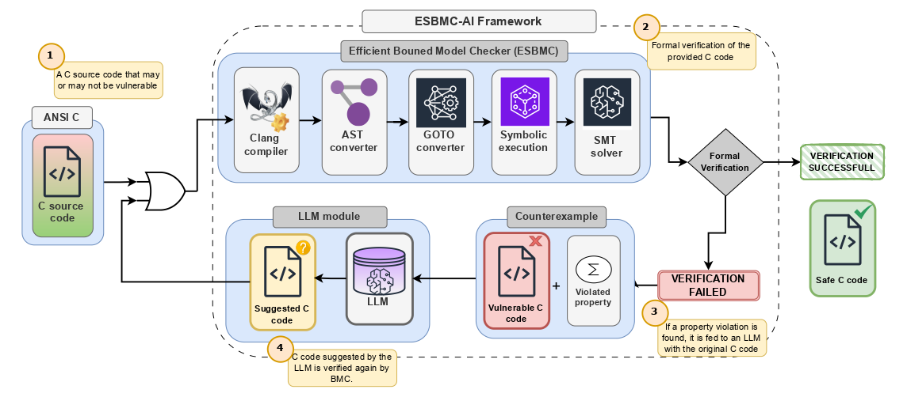
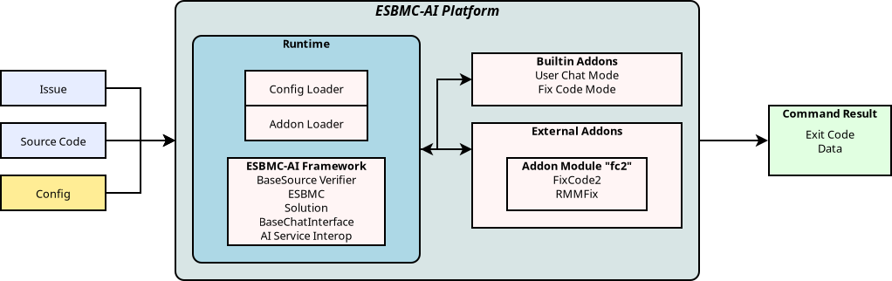

# ESBMC AI

Automated LLM Integrated Workflow Platform. Primarily oriented around Automated Program Repair (APR) research. There are different commands that can be executed with ESBMC-AI. There are different commands that ESBMC-AI can run, and can also be extended with Addons (see [below](#wiki)).

The basic repair implementation passes the output from ESBMC to an AI model with instructions to repair the code. As the output from ESBMC can be quite technical in nature.

## Demonstration

More videos can be found on the [ESBMC-AI Youtube Channel](https://www.youtube.com/@esbmc-ai)

## Wiki

For full documentation, see the [ESBMC-AI Wiki](esbmc.github.io/esbmc-ai). Quick Links:

* [Initial Setup Guide](esbmc.github.io/esbmc-ai/docs/initial-setup/).
* [Built-in Commands](http://localhost:1313/docs/commands/)
* [Addons](http://localhost:1313/docs/addons/)

## Contributing

See [this page](esbmc.github.io/esbmc-ai/contributing).

## License

[Modified GNU Affero General Public License v3.0](https://github.com/Yiannis128/esbmc-ai/blob/master/LICENSE)
