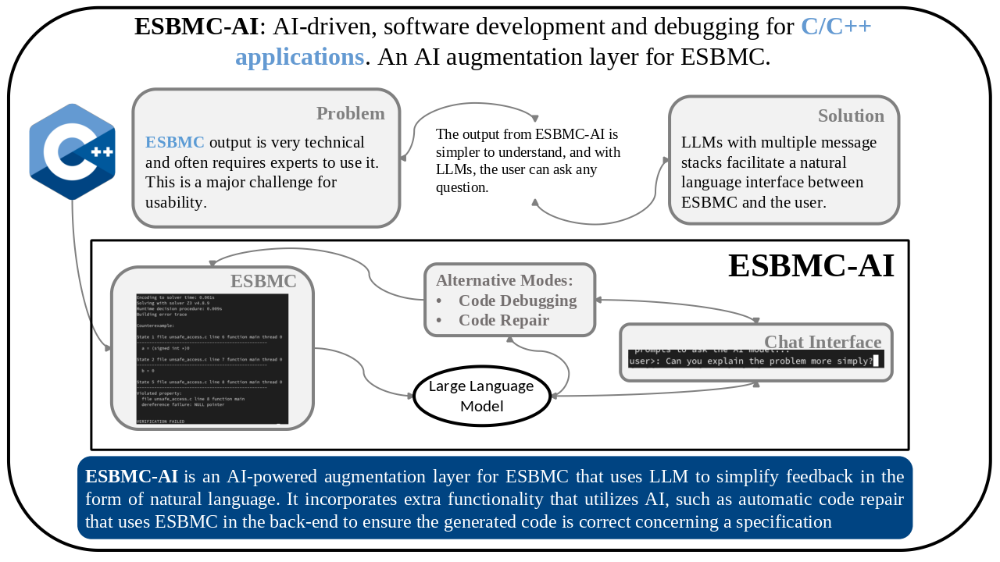

AI Augmented ESBMC processing. Passes the output from ESBMC to an AI model that allows the user to use natural language to understand the output. As the output from ESBMC can be quite technical in nature. The AI can also be asked other questions, such as suggestions on how to fix the problem outputted by ESBMC, and to offer further explanations.

This Wiki is dedicated to documenting the systems that power ESBMC-AI.

> [!WARNING]
> The project is in heavy development. There are daily changes that change the structure of the configuration files, along with features that are added/changed/removed regularly. The contents of this WIKI may be outdated.

# Resources

* A New Era in Software Security: Towards Self-Healing Software via Large Language Models and Formal Verification [arXiv:2305.14752](https://arxiv.org/abs/2305.14752) [[PDF](https://arxiv.org/pdf/2305.14752), [other](https://arxiv.org/format/2305.14752)]