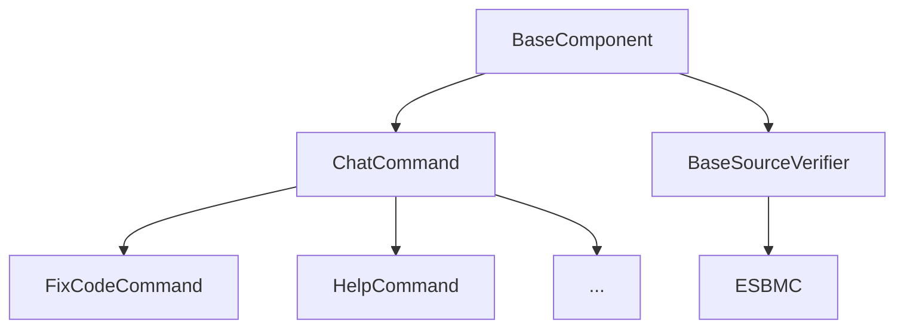

## Declaring Config Entries

A base component can interact with the config of ESBMC-AI. It can declare fields, load them, and describe how they are loaded as well. This can be done by overriding the `get_config_fields` method from `BaseComponent`.

### Addons

`BaseComponents` loaded as addons will have a prefix added to their `names` to ensure that there's never any clashes between different addons. The following example demonstrates how to deal with this.

```py
from esbmc_ai import BaseComponent, ConfigField
class ExampleAddon(BaseComponent):
    def __init__(self) -> None:
        super().__init__(verifier_name="example_addon", authors="")
        
    @override
    def get_config_fields(self) -> list[ConfigField]:
        return [
            ConfigField(
                name="example_field",
                default_value=0,
            )
        ]
```

The field will be loaded by the AddonLoader which will prepend the `addons.example_addon` to it. To load it you would need to use the following function call:

```py
self.get_config_value("addons.example_addon.example_field")
```

## Verifiers

A verifier addon can be used in any chat command that does not explicitly not allow it. The base class for verifier is `BaseSourceVerifier`. While developing a verifier addon, inherit that base class, or a derived class (if you want to inherit a specific verifier's functionality).

## ChatCommands

A chat command is a class that can be executed by the ESBMC-AI platform allowing you specify custom behaviour that uses the ESBMC-AI framework. Create a new class and make it inherit `ChatCommand`.

### Allowing Only Certain Verifiers

If you want to allow a certain type of verifier only to be used in your addon, you can check by type (as the example shows below) or use any other checks:

```py
if not isinstance(verifier, ESBMC):
    self.logger.error(
        f"The following verifier {verifier.name} is not compatible, "
        "use addons that inherit ESBMC"
    )
    sys.exit(1)
```