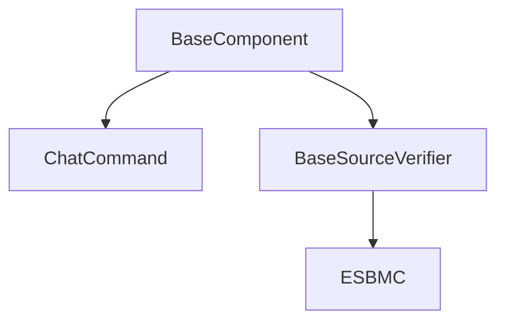

### BaseComponent




#### Specifying Config Field Entries


### Verifiers

A verifier addon can be used in any chat command that does not explicitly not allow it. The base class for verifier is `BaseSourceVerifier`. While developing a verifier addon, inherit that base class, or a derived class (if you want to inherit a specific verifier's functionality).

### ChatCommands

A chat command is a class that can be executed by the ESBMC-AI platform allowing you specify custom behaviour that uses the ESBMC-AI framework. Create a new class and make it inherit `ChatCommand`.

#### Allowing Only Certain Verifiers

If you want to allow a certain type of verifier only to be used in your addon, you can check by type (as the example shows below) or use any other checks:

```py
if not isinstance(verifier, ESBMC):
    log0(
        f"The following verifier {verifier.name} is not compatible, "
        "use addons that inherit ESBMC", post_label="Error"
    )
    sys.exit(1)
```